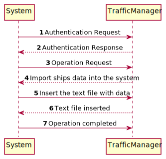
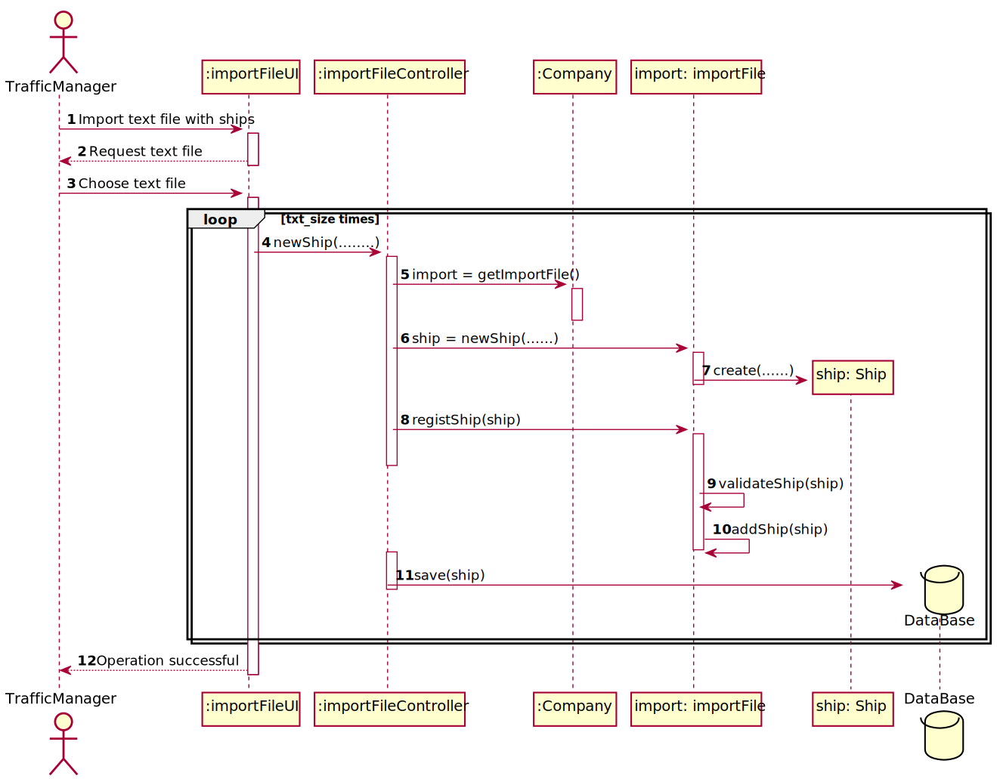
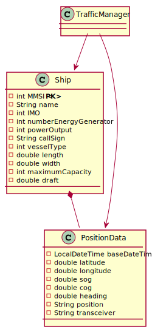

# US101 - Import ships from a text file

## Brief description

The traffic manager already registered in the system enters login. The system asks for the necessary credentials. The traffic manager enters the system and selects the option to import ships and position data messages from a text file into a BST. The system asks for the path to the text file with data. The traffic manager enter the path and the system imports after validation. The system informs that the ship data was successfully imported to the system and also shows the number of ships imported.

## Design

### SSD

### SD

### CD

## Tests Description

To test this US 3 different AVL are created(One for each comparable field). Having this three differently organized trees, multiple tests check if the ships are ordered in the right way.

Fo example :

    Create one avl ordered by MMSI. After that, a test is created to make sure that the ships are ordered by MMSI on the three. For that, inOrder() method is used to facilitate the analysis.

The same method is used to test the other 2 trees(ordered by IMO and Call Sign). To complement the previous tests, I also test the size of the trees for more guarantee.

