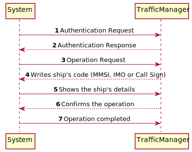
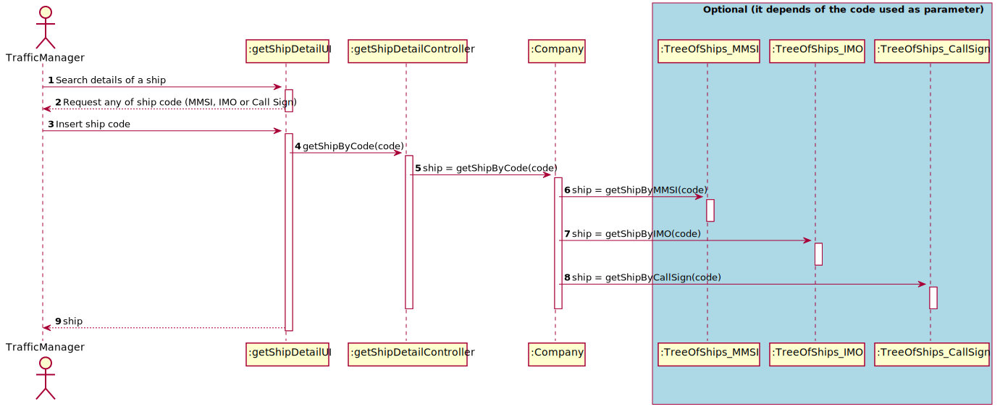

# US102 - Searching the details of a ship using any of its codes #

### Brief Analysis

The traffic manager already registered in the system enters login. 
The traffic manager choose this US and must write a code. It must be the MMSI, the IMO or the Call Sign of the ship. 
The information about the ship is correctly showed in the console.

### SSD

### SD

### CD

## Tests Description

To test this US 3 different AVL are created(One for each comparable field). 
Having this three differently organized trees, we can confirm that the all the methods to get the ship information 
through the MMSI, IMO and Call Sign.

For example:

    Create one avl ordered by MMSI to confirm if with a given MMSI the ship return is the correct.

The same method is used to test the other 2 trees(ordered by IMO and Call Sign).

With this, all the three possible ways to get the ship information are tested.