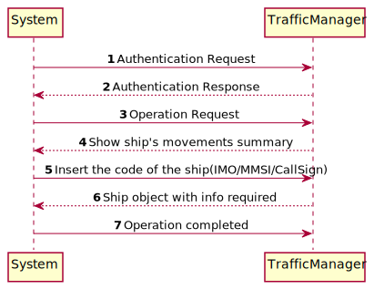
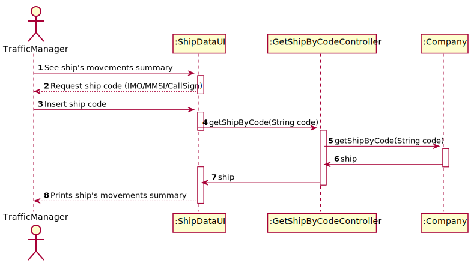
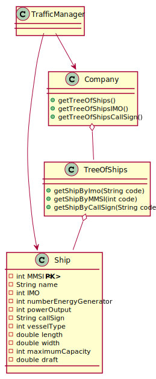

# US104 - Summary of a ship's movements

## Brief description

The traffic manager already registered in the system enters login. The system asks for the necessary credentials. The traffic manager enters the system and selects the option to see a ship's movements summary. The system asks for the ship code. The traffic manager enters the code and the system returns the ship's information if found. 

## Design

### SSD

### SD

### CD

## Tests Description

To test this US were created ships for testing purpose only. Then, calculated manually the values expected and asserted them with the actual output of us methods.

Fo example :

    Created a ship with 2 movements only and travelled distance of 20km and delta distance of 2km. Then, assert this results with the outcome of the UI.

Every value was tested in order to ensure full coverage of the US.