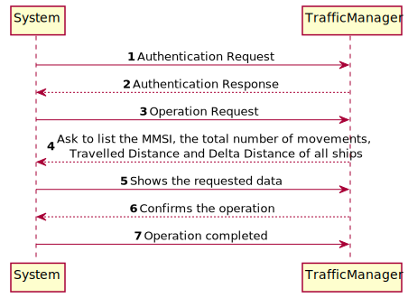
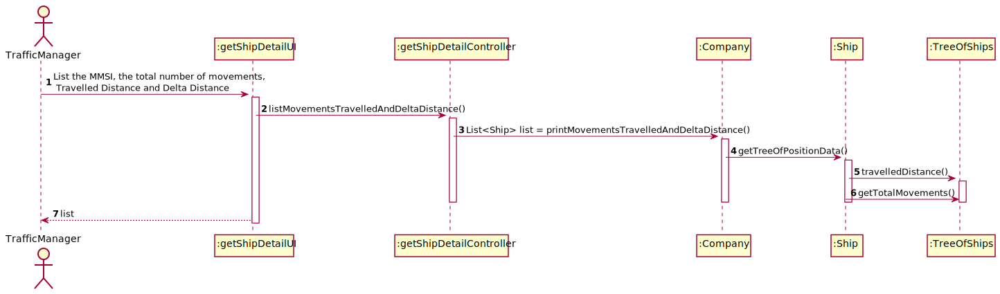

# US105 - List for all ships the MMSI, the total number of movements, Travelled Distance and Delta Distance #

### Brief Analysis

The traffic manager already registered in the system enters login. 
The traffic manager choose this US and the asked info is showed in the console.
The information about the ship is correctly showed in the console rdered by Travelled Distance and total number of movements (descending/ascending).

### SSD

### SD

### CD

## Tests Description

To test this US one AVL tree is created from the file with ships information.
We order it manually through a comparator so we can test with the method.

In order to get the full 100% coverage in this tests we need to test the method "getDeltaDistance" so we use the static 
method "Distance.distance(...)" using an example from a file. 

With this we guarantee 100% test successful.
