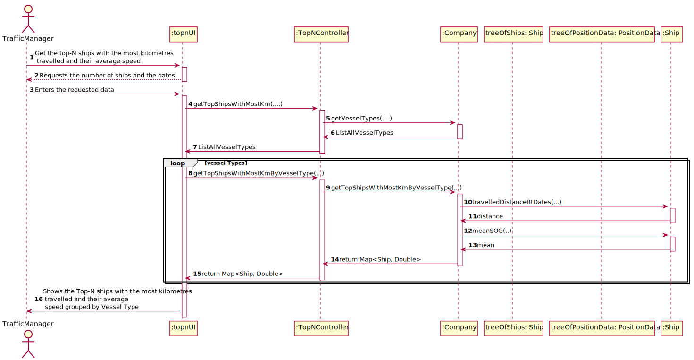
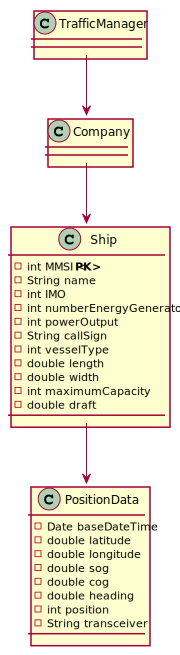

# US106 - Get the top-N ships with the most kilometres travelled and their average speed(MeanSOG).

## Brief Description

The traffic manager already registered in the system enters logins. The system asks for the necessary credentials. 
The traffic manager enters the system and selects the option to this US106(option 6).
The system requests the number of ships and dates. The traffic managers enters that information.
The system validates the data and displays the information that was asked.

## Design

### SSD

### SD

### CD

### Test Description

In this US, the tests that were done specifically for this US were done in company, and all the methods that were used in side on the main ones, in order to guarantee all the information was delivered right.
The tests will confirm the possibilities that were created in the methods to tests every type of event.