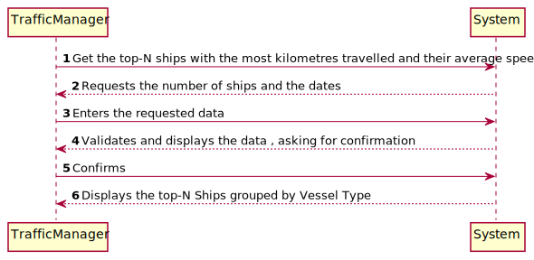
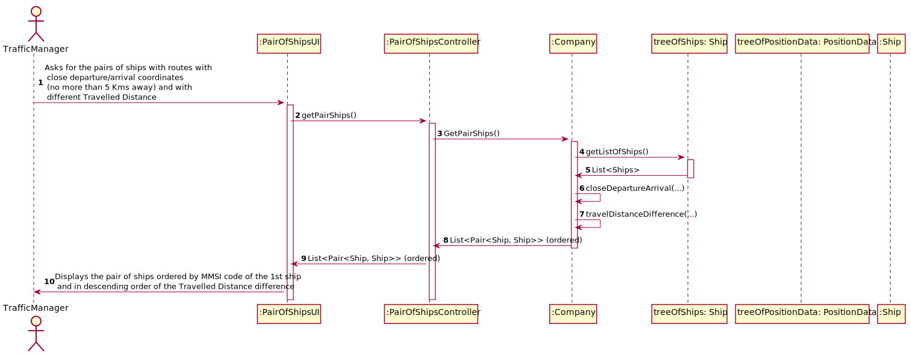
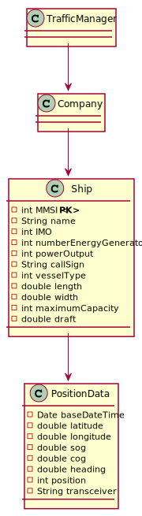

# US107 - Return pairs of ships with routes with close departure/arrival coordinates (no more than 5 Kms away) and with different Travelled Distance.

## Brief Description

The traffic manager already registered in the system enters logins. The system asks for the necessary credentials. 
The traffic manager enters the system and selects the option to this US107(option 7).
The system requests the number of ships and dates. The traffic managers enters that information.
The system validates the data and displays the information: Return pairs of ships with routes with close departure/arrival coordinates (no more than 5 Kms away) and with different Travelled Distance. 

## Design

### SSD

### SD

### CD

### Test Description

In this US, the tests that were done specifically for this US were done in company and other classes related to this US. All the methods that were used in side on the main ones, in order to guarantee all the information was delivered right.
The tests will confirm the possibilities that were created in the methods to tests every type of event.