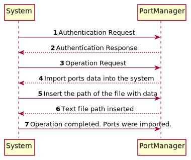

# US201 - Import ports from a text file

## Brief description

The port manager already registered in the system enters login. The system asks for the necessary credentials. The port manager enters the system and selects the option to import ports from a text file into a 2D-tree. The system asks for the path to the text file with data. The port manager enter the path and the system imports after validation. The system informs that the port data was successfully imported to the system and also shows the number of ports imported.

## Design

### SSD

### SD

### CD

## Tests Description

