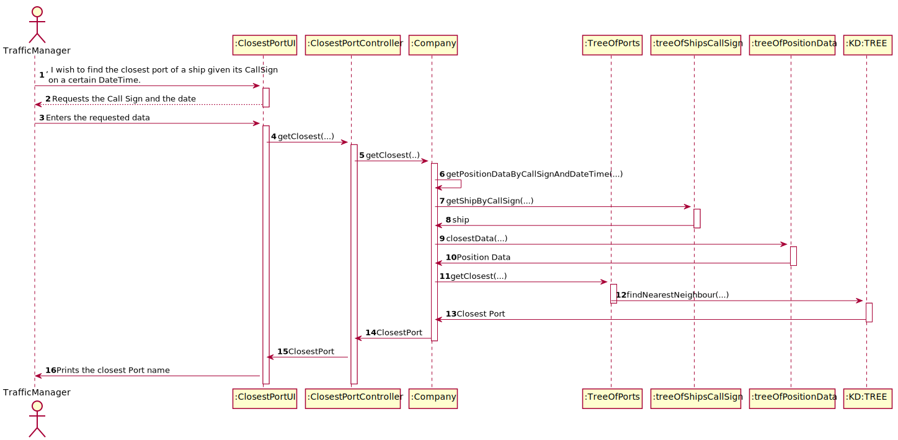

# US202 - I which to find the closest port of a ship given its CallSign, on a certain DateTime.

## Brief description

The traffic manager already registered in the system enters login. The system asks for the necessary credentials. The traffic manager enters the system and selects the option to find the closest port. The system asks the call sign and the date. The traffic manager enters the requested data and the system validates. The system informs which is the closest port data.

## Design

### SSD

### SD

### CD

### UCD

