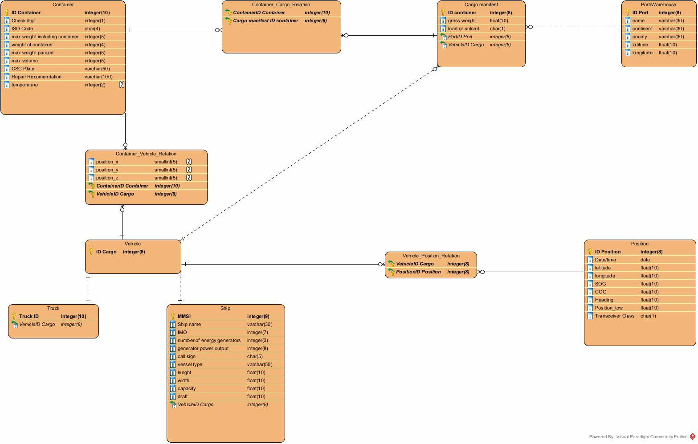

# US103 - As a traffic manager I which to have the positional messages temporally organized and associated with each of the ships

## Brief Description

As Project Manager, I want the team to review the relational data model in view
of the new user stories, so it can support all the requirements to fulfil the purpose of the
system being developed.

## Achievments

-The following deliverables are expected: (1) revised relational data model
in 3NF, (2) revised SQL script to create the database schema in Oracle
(physical data model) and (3) database bootstrap script.
-It is possible to run a SQL script to create the database schema in a
complete and consistent way without errors.
-It is possible to run a script to load the database with enough data to
explore the database and run the user stories (database bootstrap script).

## Modelo de Domínio

