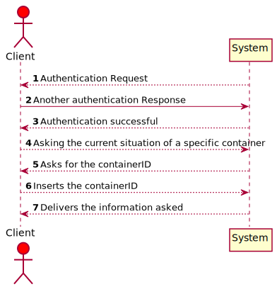
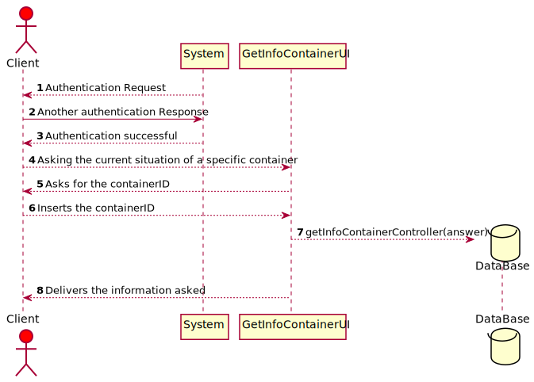
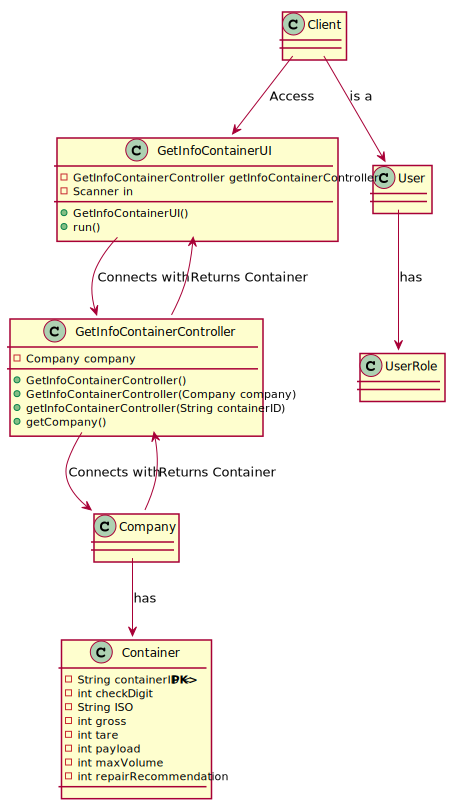

# US203 - As Client, I want to know the current situation of a specific container being used to transport my goods

## Brief Description

As Client, I want to know the current situation of a specific container being used to transport my goods
Authentication Request.
Another authentication Response.
Authentication successful.
Asking the current situation of a specific container.
Asks for the containerID.
Inserts the containerID.
Delivers the information asked.

## Design

### SSD

### SD

### CD

### Test Description

In this US the tests that were done specifically for this US were done in the company and other classes relative to this US, in order to check the return of the objects were in order by Date and if the return of the HashMap on the company was exactly the same of the controller.
The tests will confirm the possibilities that were created in the methods to tests every type of event.