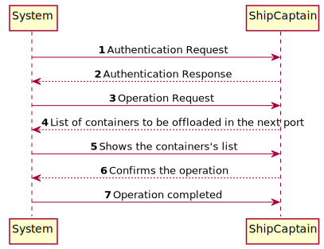
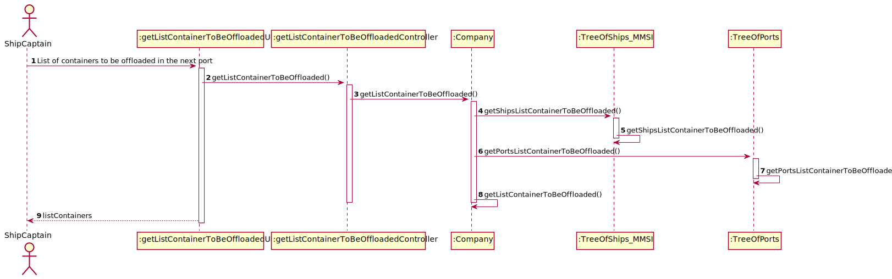
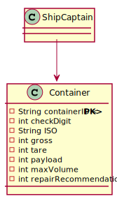

# US205 - List of containers to be offloaded in the next port, including container identifier, type, position, and load #

### Brief Analysis

The Ship Captain already registered in the system enters login. 
The Ship Captain choose this US and the asked info is showed in the console.
The information about the containers is correctly showed in the console including container identifier, type, position, and load.

### SSD

### SD

### CD

## Tests Description

...
