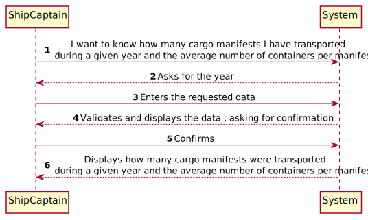
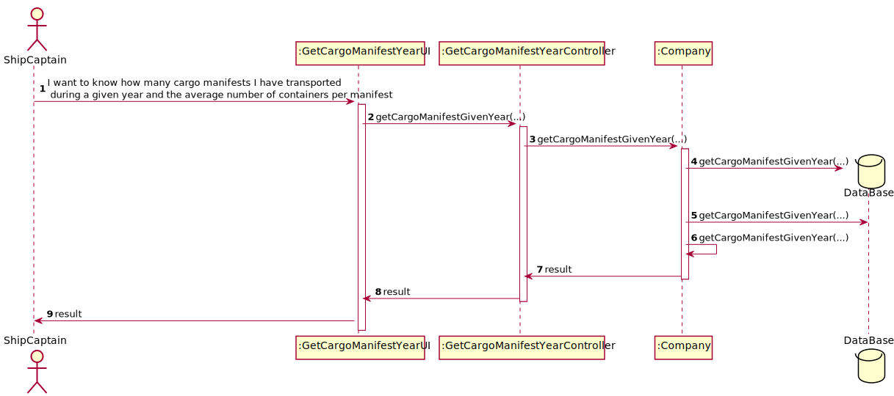
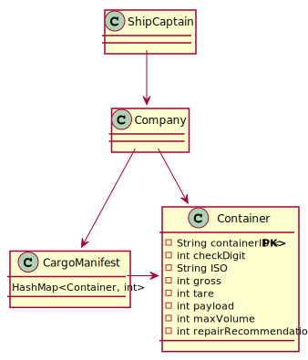

# US207 - As Ship Captain, I want to know how many cargo manifests I have transported during a given year and the average number of containers per manifest

### Brief Analysis

The Ship Captain already registered in the system enters login.
The Ship Captain choose this US and the system asks for the year.
How many cargo manifests were transported during a given year and the average number of containers per manifest is displayed.

### SSD

### SD

### CD

