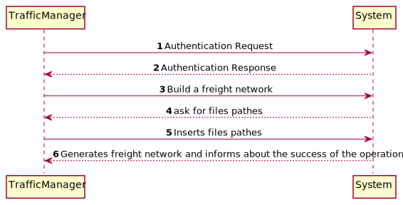
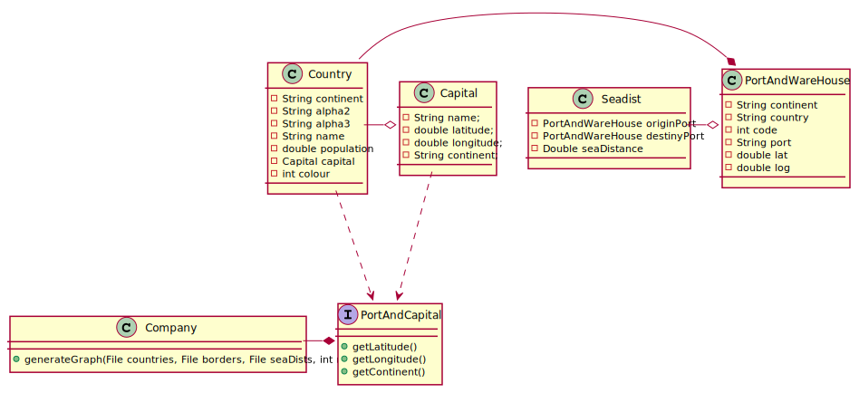
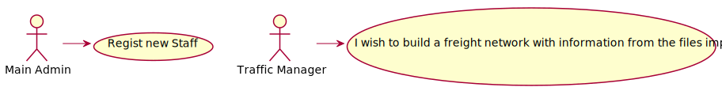

# US301 - I wish to build a freight network

## Brief description

The traffic manager already registered in the system enters login. The system asks for the necessary credentials. The traffic manager enters the system and selects the option to build the freight network. The system builds the freight network.

## Design

### SSD

### SD

### CD

### UCD

