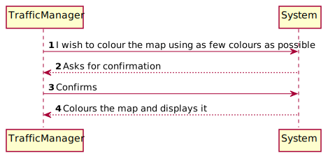
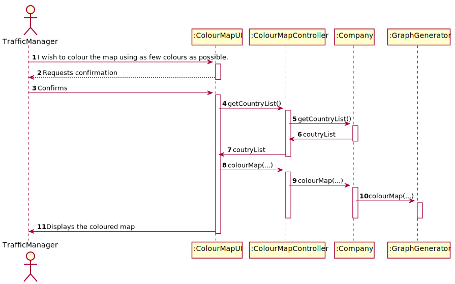
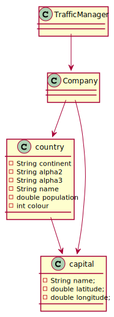

# US302 - I wish to colour the map using as few colours as possible

## Brief description

The traffic manager already registered in the system enters login. The system asks for the necessary credentials. The traffic manager enters the system and selects the option to colour the map. The system colors the map.

## Design

### SSD

### SD

### CD

### UCD

