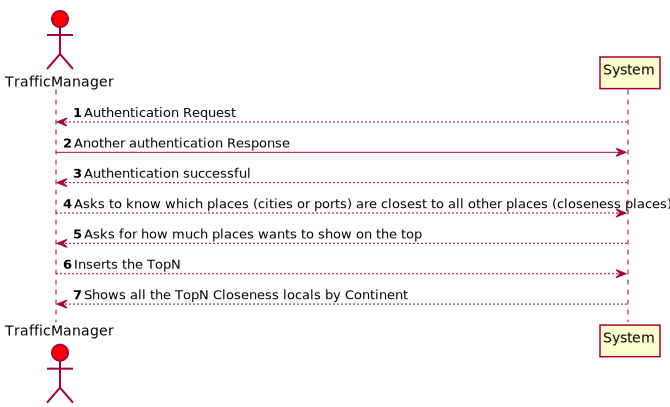
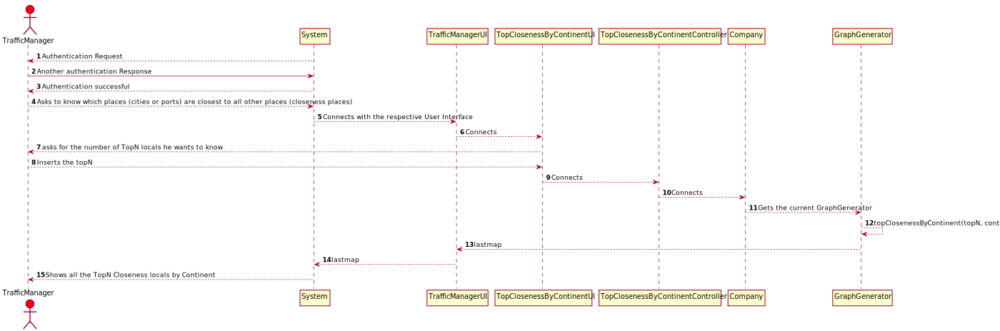
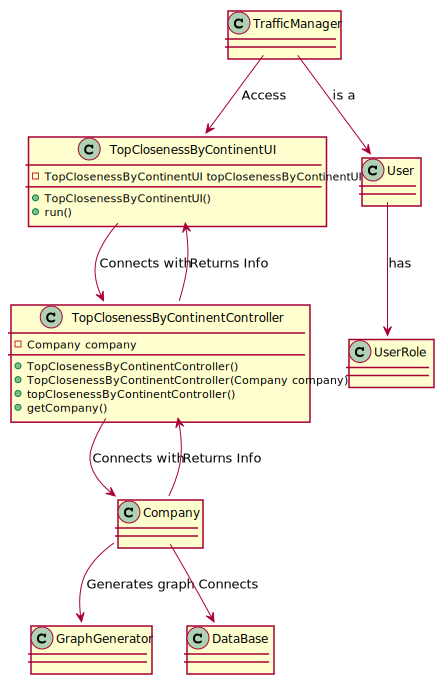

# US303 As a Traffic manager I wish to know which places (cities or ports) are closest to all other places (closeness places).
## Brief Description

The Traffic manager selects the menu option "Know which places (cities or ports) are closest to all other places (closeness places).".
The System will show the the places with the best average closeness 

## Design

### SSD

### SD

### CD

### Test Description

In this US the tests that were done specifically for this US were done in the Controller, to check if the app instance is equals as the company.
The tests will confirm the possibilities that were created in the methods to tests every type of event.