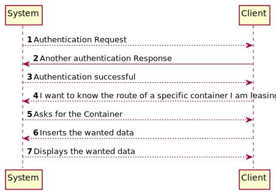
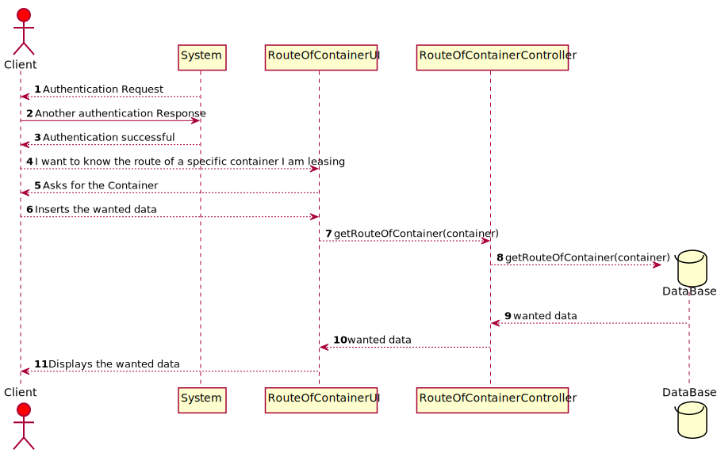
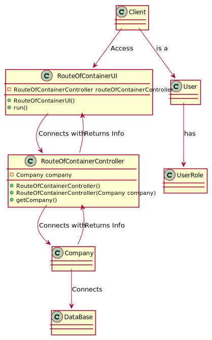

# US305 I want to know the route of a specific container I am leasing
## Brief Description

Users provide their registration code, the container identifier and get its
path, from source to current location indicating time of arrival and
departure at each location and mean of transport (ship or truck) between
each pair of locations.

## Design

### SSD

### SD

### CD

