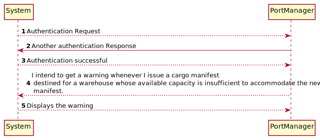
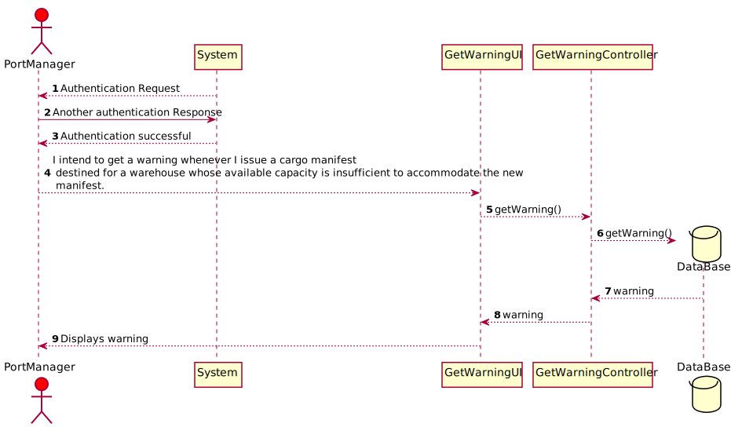
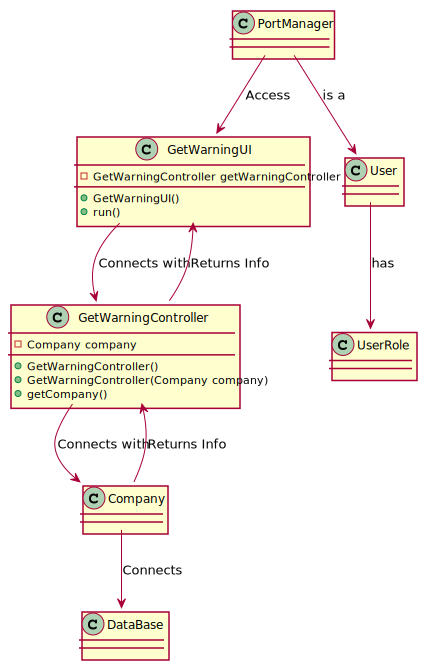

# US307 I intend to get a warning
## Brief Description

I intend to get a warning whenever I issue a cargo manifest destined for a warehouse whose available capacity is insufficient to accommodate the new manifest.

## Design

### SSD

### SD

### CD

