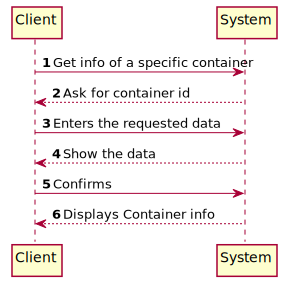
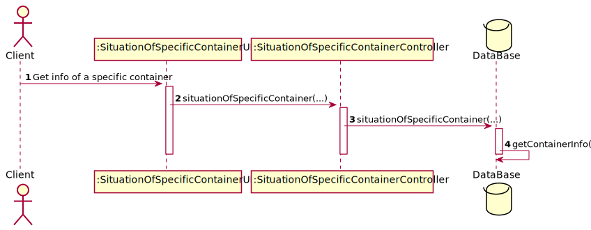
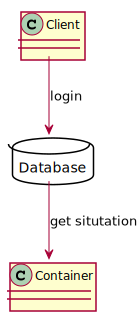

# US314 - I wish to know the total number of \nfree/occupied slots in the transport vehicle

## Brief description

The Client already registered in the system enters login. The system asks for the necessary container id. The Client enters id. The system shows the data.

## Design

### SSD

### SD

### CD

