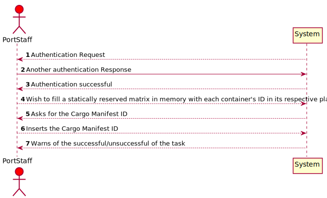
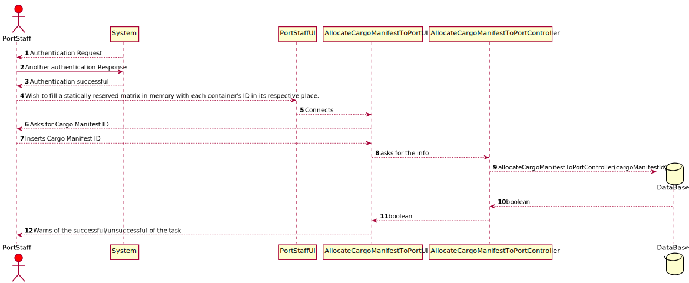

# US313 As a Port staff, given a Cargo Manifest, I wish to fill a statically reserved matrix in memory with each container's ID in its respective place.

## Brief Description

As a Port staff, given a Cargo Manifest, I wish to fill a statically reserved matrix in memory with each container's ID in its respective place.
The system does that requirement.

## Design

### SSD

### SD

### CD

### Test Description

In this US the tests that were done specifically for this US were done in the Controller, to check if the app instance is equals as the company.
The tests will confirm the possibilities that were created in the methods to tests every type of event.