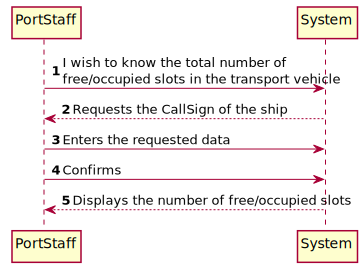
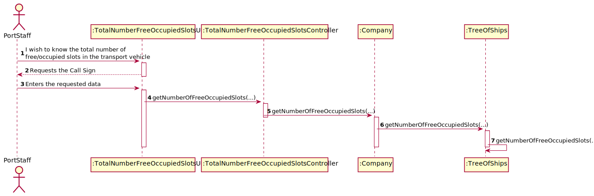
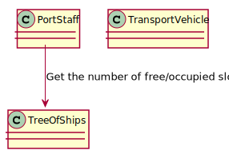

# US314 - I wish to know the total number of \nfree/occupied slots in the transport vehicle

## Brief description

The PortStaff already registered in the system enters login. The system asks for the necessary credentials. The Port Staff enters the system and selects the get the number of free/occupied slots. The system asks the call sign. The Port Staff enters the requested data and the system validates. The system informs the number of free/occupied slots.

## Design

### SSD

### SD

### CD

