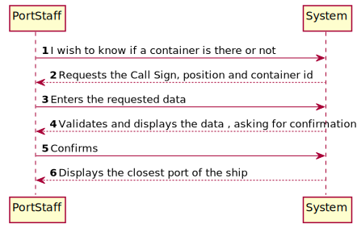
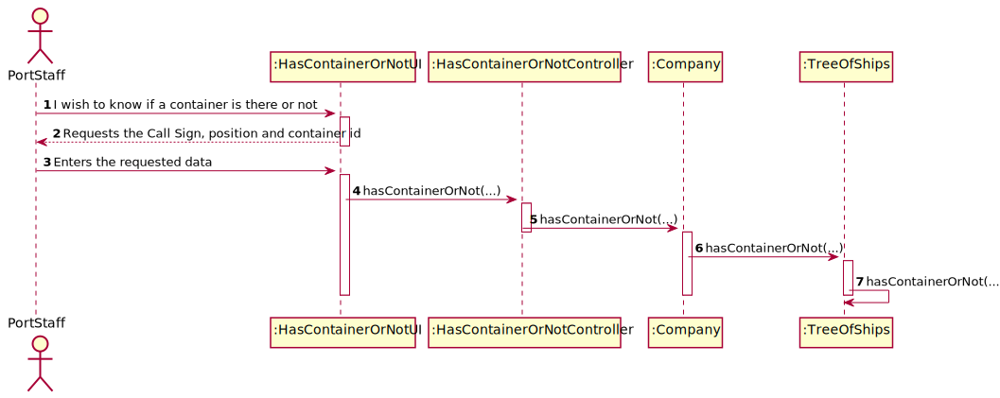
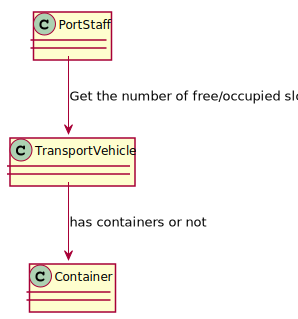

# US315 - Given a position in the transport vehicle, I wish to know if a container is there or not.

## Brief description

The PortStaff already registered in the system enters login. The system asks for the necessary credentials. The Port Staff enters the system and selects the has container or not. The system asks the needed data. The Port Staff enters the requested data and the system validates. The system informs if the container is there or not.

## Design

### SSD

### SD

### CD

