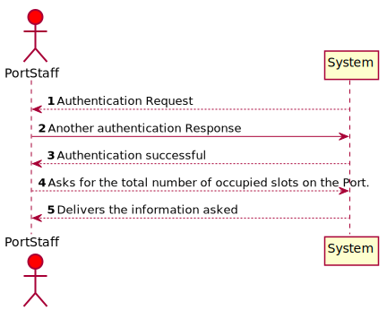
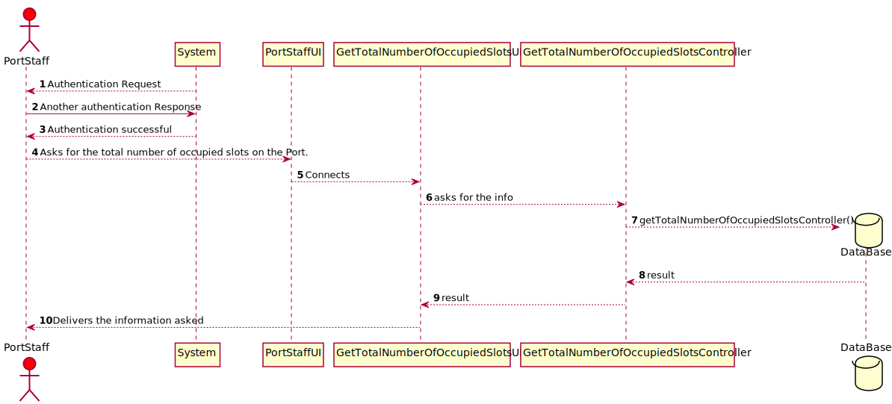
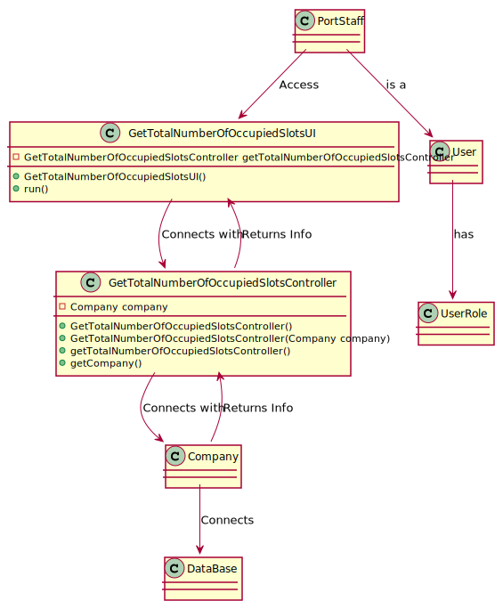

# US316 - As a Port staff, given a set of positions, I wish to know the total number of occupied slots

## Brief Description

## Design

### SSD

### SD

### CD

### Test Description

In this US the tests that were done specifically for this US were done in the Controller, to check if the app instance is equals as the company.
The tests will confirm the possibilities that were created in the methods to tests every type of event.