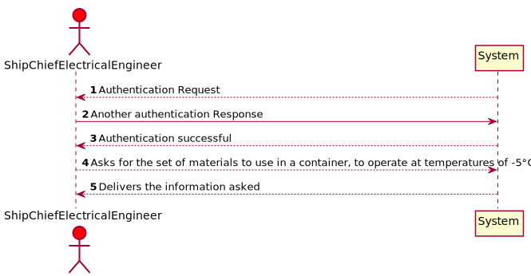
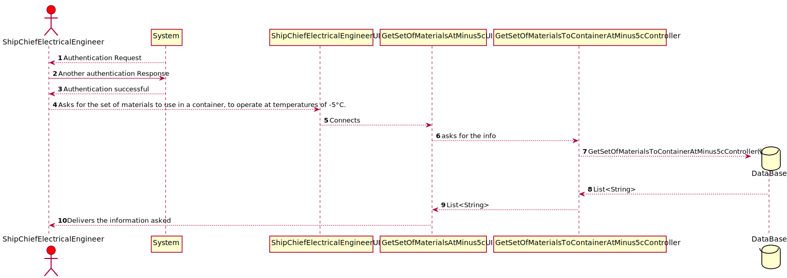
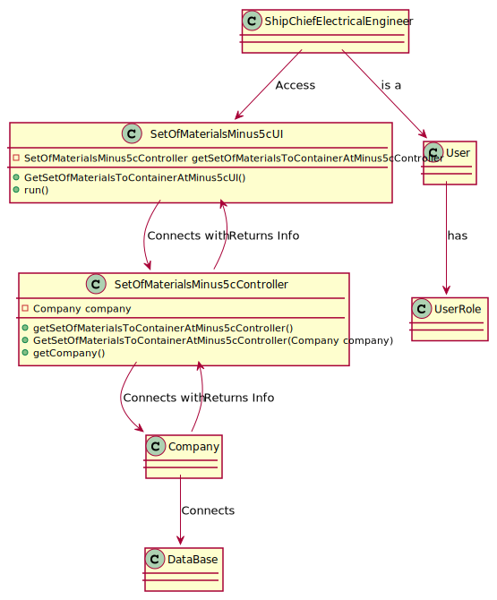

# US318 - As Ship Chief Electrical Engineer I want to know what set of materials to use in a container, to operate at temperatures of -5°C.

## Brief Description

The Ship Chief Electrical Engineer selects the menu option "Get what set of materials to use in a container, to operate at temperatures of -5°C".
The System will show the set of materials to use in a container, to operate at temperatures of -5°C.

## Design

### SSD

### SD

### CD

### Test Description

In this US the tests that were done specifically for this US were done in the Controller, to check if the app instance is equals as the company.
The tests will confirm the pos