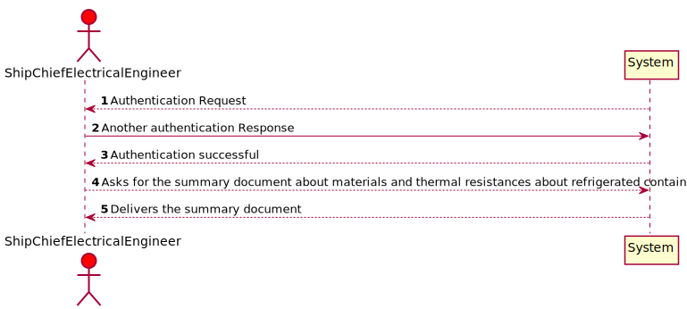
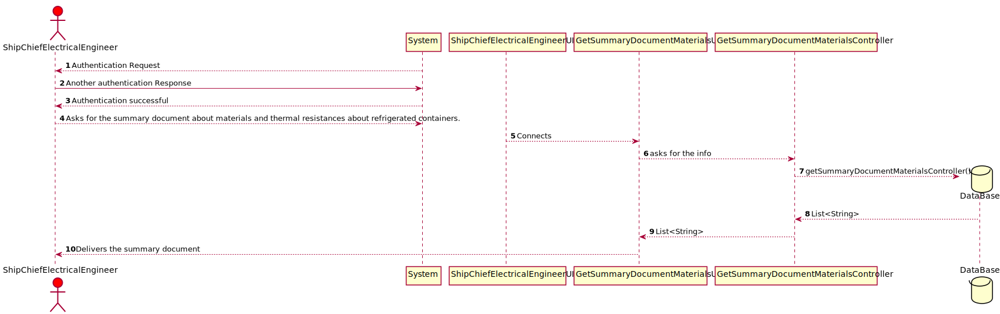
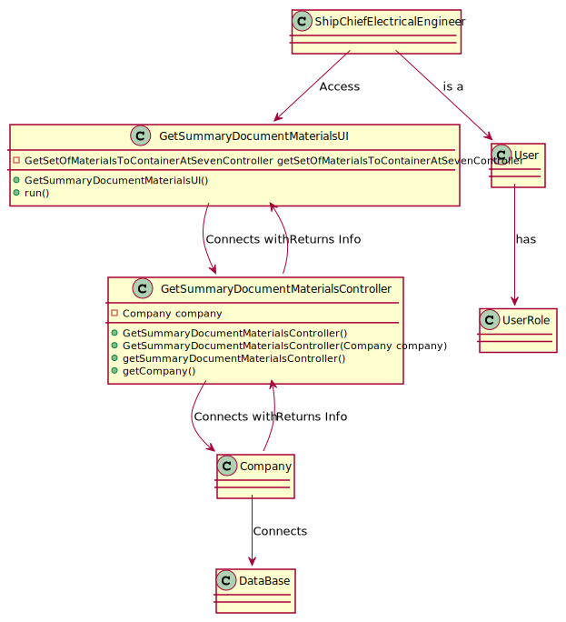

# US320 As Ship Chief Electrical Engineer I intend to present in a summary document, the choice of materials considered for the two types of containers considered, and their thermal resistances.

## Brief Description

The Ship Chief Electrical Engineer selects the menu option "Get Summary Documents on materials, thermal resistances of refrigerated containers".
The System will show the summary document, the choice of materials considered for the two types of containers considered, and their thermal resistances.

## Design

### SSD

### SD

### CD

### Test Description

In this US the tests that were done specifically for this US were done in the Controller, to check if the app instance is equals as the company.
The tests will confirm the possibilities that were created in the methods to tests every type of event.