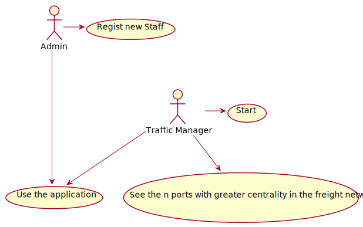
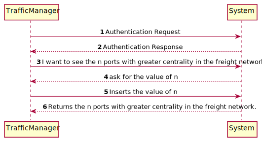
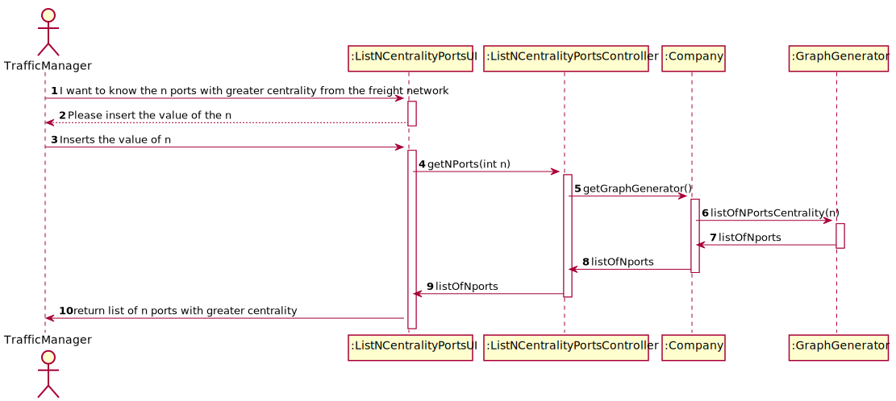
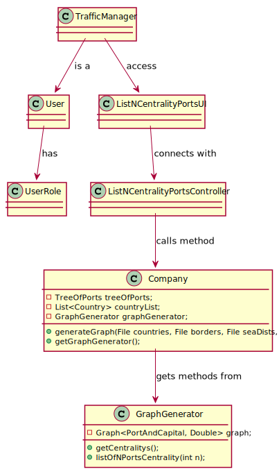

# US401 - I wish to build a freight network

## Brief description

The traffic manager already registered in the system enters login. The system asks for the necessary credentials. The traffic manager enters the system and selects the option to see the n ports with greater centrality of the freight network. The system iterate through the freight network and returns a list of ports.

## Design

### UC

### SSD

### SD

### CD

