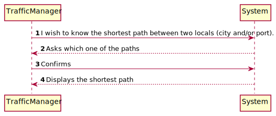
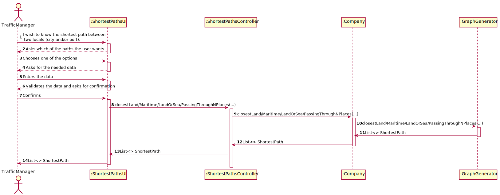
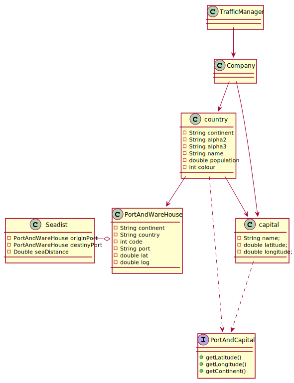

# US402 - As a Traffic manager I wish to know the shortest path between two locals (city and/or port).

## Brief description

The traffic manager already registered in the system enters login. The system asks for the necessary credentials. The traffic manager enters the system and selects the option to find the shortest path. Then the system asks which
one of the shortest paths does the user want to know. The traffic manager selects on options and enters the 
required data. The system displays the shortest path.

## Design

### SSD

### SD

### CD

### UCD

