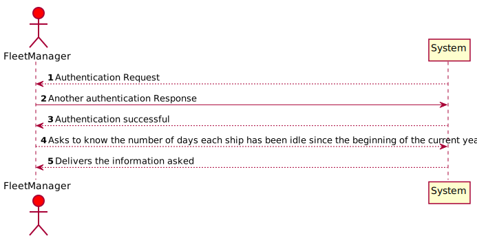
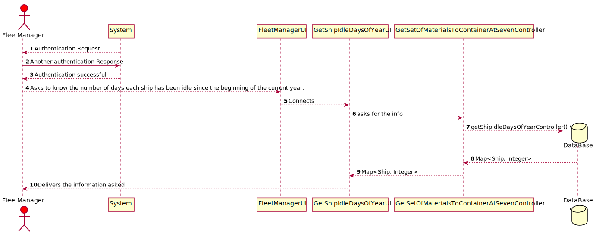
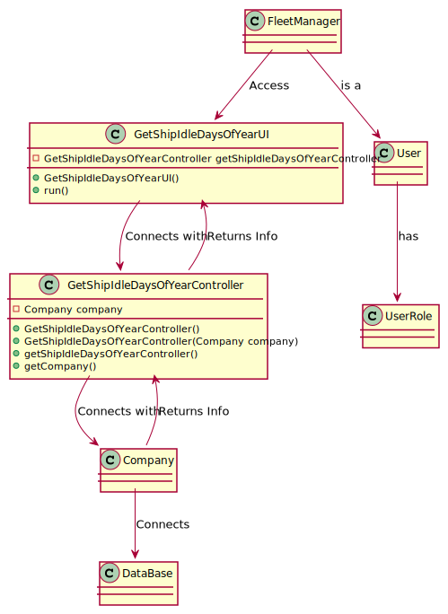

# US404 - As Fleet Manager, I want to know the number of days each ship has been idle since the beginning of the current year.

## Brief Description

As Fleet Manager, I want to know the number of days each ship has been idle
since the beginning of the current year.
As fleet manager logins inserts option 1 and then everything will be delivered.

## Design

### SSD

### SD

### CD

### Test Description

In this US the tests that were done specifically for this US were done in the Controller, to check if the app instance is equals as the company.
The tests will confirm the possibilities that were created in the methods to tests every type of event.