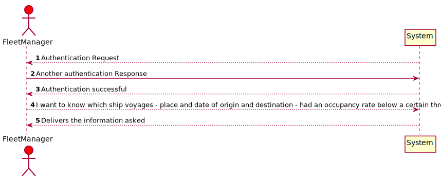
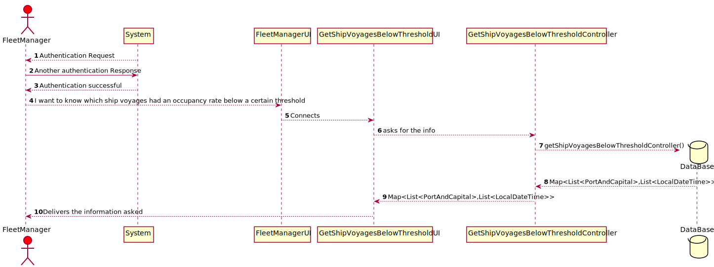
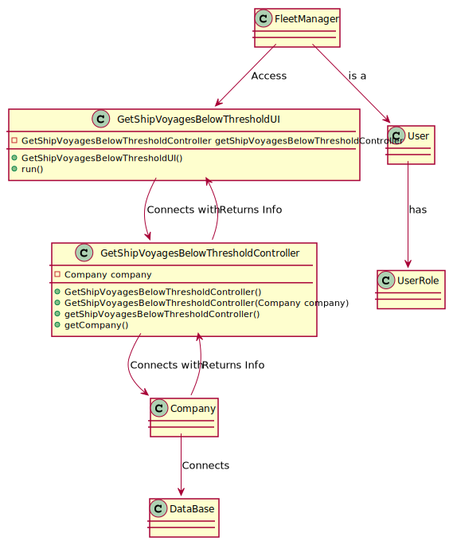

# US406 - As Fleet Manager, I want to know which ship voyages – place and date of origin and destination – had an occupancy rate below a certain threshold; by default, consider an occupancy rate threshold of 66%. Only the trips already concluded are to be considered.

## Brief Description

As Fleet Manager,  I want to know which ship voyages – place and date of origin
and destination – had an occupancy rate below a certain threshold; by default, consider an
occupancy rate threshold of 66%. Only the trips already concluded are to be considered.
As fleet manager logins inserts option 4 and then everything will be delivered.

## Design

### SSD

### SD

### CD

### Test Description

In this US the tests that were done specifically for this US were done in the Controller, to check if the app instance is equals as the company.
The tests will confirm the possibilities that were created in the methods to tests every type of event.