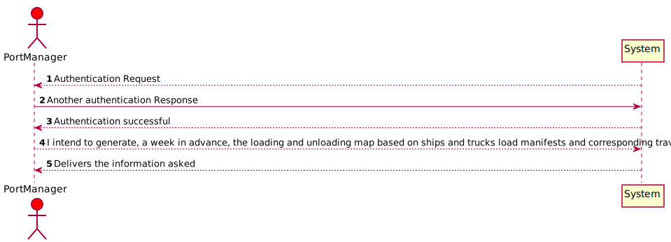
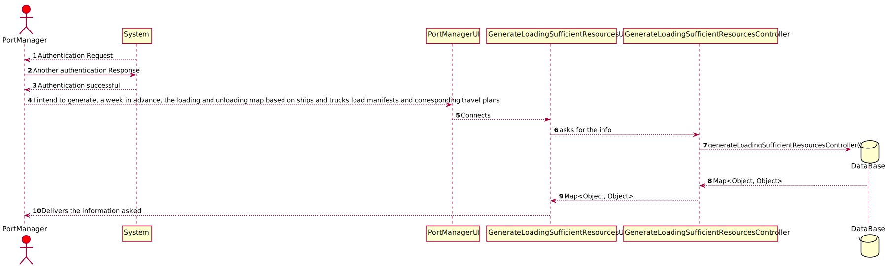
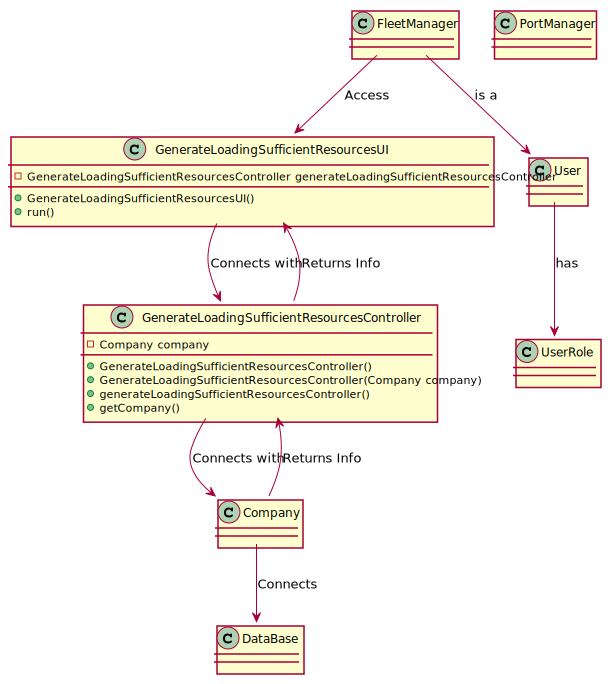

# US407 - As Port manager, I intend to generate, a week in advance, the loading and unloading map based on ships and trucks load manifests and corresponding travel plans, to anticipate the level of sufficient and necessary resources (loading and unloading staff, warehouse staff, ...).

## Brief Description

As Port manager, I intend to generate, a week in advance, the loading and unloading map based on ships and trucks load manifests and corresponding travel plans, to anticipate the level of sufficient and necessary resources (loading and unloading staff, warehouse staff, ...).
As Port manager logins inserts option 4 and then everything will be delivered.

## Design

### SSD

### SD

### CD

### Test Description

In this US the tests that were done specifically for this US were done in the Controller, to check if the app instance is equals as the company.
The tests will confirm the possibilities that were created in the methods to tests every type of event.