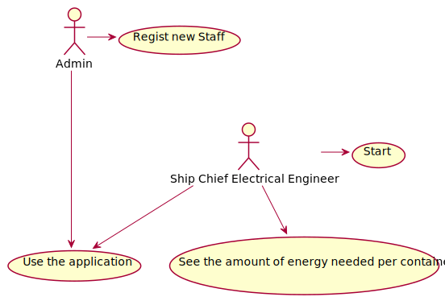
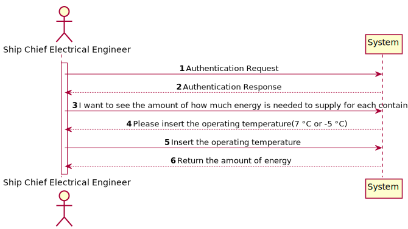
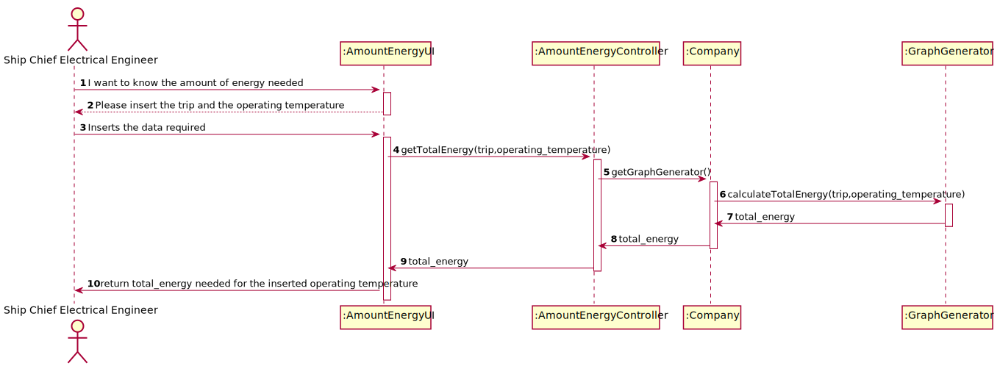
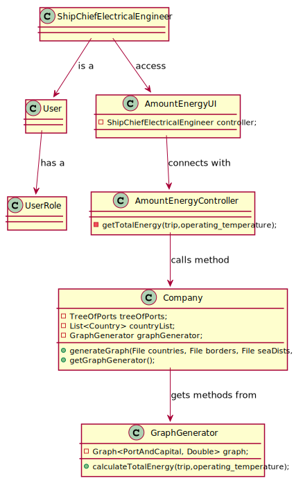

# US412 - I wish to know the amount of energy

## Brief description

The Ship Chief Electrical Engineer already registered in the system enters login. The system asks for the necessary credentials. The Ship Chief Electrical Engineer enters the system and selects the option to know how much energy to
supply, for each container, in a determined trip, with an exterior temperature of 20 ºC, and a travel time of 2h30. The system returns the amount of energy needed.

## Design

### UC

### SSD

### SD

### CD

