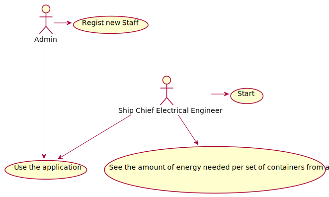
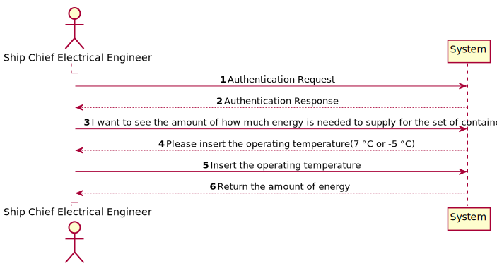
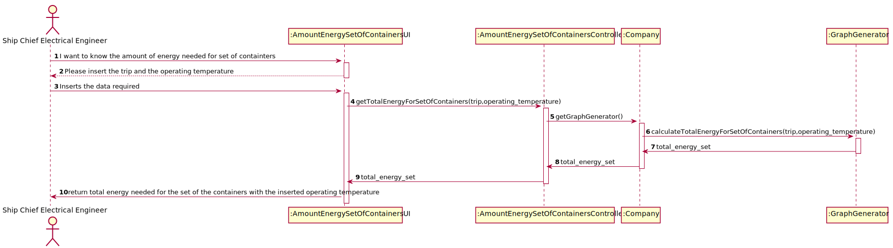
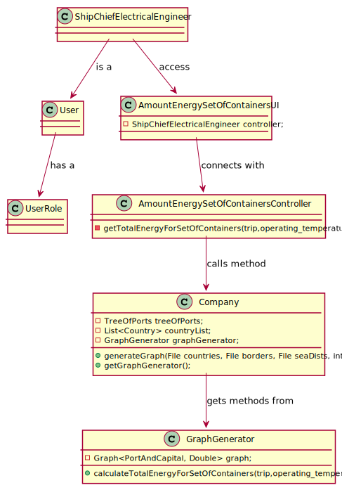

# US413 - I wish to know the amount of energy for a set of containers

## Brief description

The Ship Chief Electrical Engineer already registered in the system enters login. The system asks for the necessary credentials. The Ship Chief Electrical Engineer enters the system and selects the option to know how much energy to
supply, in a determined trip, where all containers have the same behaviour. The system returns the amount of energy needed.

## Design

### UC

### SSD

### SD

### CD

