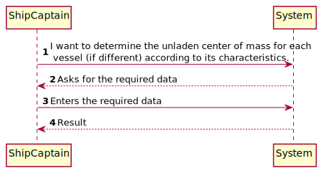
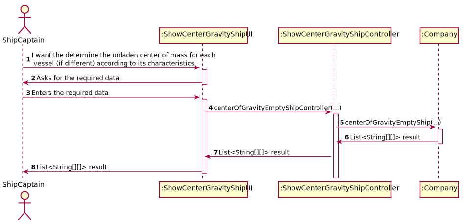
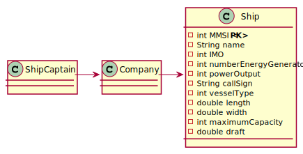
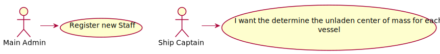

# US418 - As the Ship Captain I want the determine the unladen center of mass for each vessel

## Brief description

The Ship Captain already registered in the system enters login. The system asks for the necessary credentials.
The Ship Captain I want to determine the unladen center of mass for each
vessel (if different) according to its characteristics. For calculation purposes, consider
known geometric figures

## Design

### SSD

### SD

### CD

### UCD

